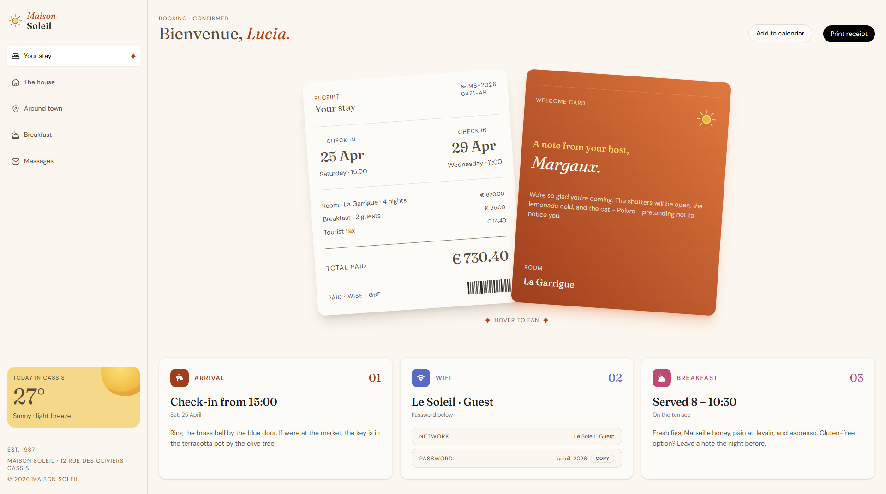

# Frontend Mentor - Hotel booking confirmation page solution

This project is a responsive React + TypeScript implementation of the Frontend Mentor challenge for a hotel booking confirmation experience. The UI combines a polished welcome section, a payment summary card, a guide area with arrival and breakfast instructions, and a Wi-Fi card with copy-to-clipboard functionality.

## Table of contents

- [Overview](#overview)
  - [The challenge](#the-challenge)
  - [Features](#features)
- [My process](#my-process)
  - [Built with](#built-with)
  - [What I learned](#what-i-learned)
  - [Continued development](#continued-development)
  - [Useful resources](#useful-resources)
  - [AI collaboration](#ai-collaboration)
- [Getting started](#getting-started)
- [Project structure](#project-structure)
- [Author](#author)

## Overview


### The challenge

Users should be able to:

- View the interface in an optimized layout for both mobile and desktop screens
- Explore a visually rich confirmation page with clear information hierarchy
- Interact with the Wi-Fi card to copy the guest password to the clipboard
- Enjoy a polished experience with responsive behavior and subtle motion effects

### Features

- Responsive design adapted for small and large screens
- Hero section with layered cards and hover interactions
- Guided information blocks for arrival, Wi-Fi, and breakfast
- Copy-to-clipboard support for the Wi-Fi password

## My process

### Built with

- [React](https://react.dev/)
- [TypeScript](https://www.typescriptlang.org/)
- [Vite](https://vite.dev/)
- [Tailwind CSS](https://tailwindcss.com/)
- [ESLint](https://eslint.org/) and [Prettier](https://prettier.io/)

### What I learned

This challenge helped me strengthen my skills in:

- Building responsive interfaces with a mobile-first approach
- Structuring reusable UI components in React
- Combining utility-first styling with custom component patterns
- Implementing small interactive details such as clipboard actions and hover states

### Continued development

I would like to keep improving this project by:

- Refining the motion and transition details
- Expanding accessibility and keyboard interaction support

### Useful resources

- [Frontend Mentor challenge](https://www.frontendmentor.io/challenges/hotel-booking-confirmation-page)
- [React documentation](https://react.dev/learn)
- [Tailwind CSS documentation](https://tailwindcss.com/docs)

## Getting started

Install dependencies:

```bash
npm install
```

Run the development server:

```bash
npm run dev
```

Build for production:

```bash
npm run build
```

## Project structure

```text
src/
  components/
    sections/
    GuideCard.tsx
    PaymentCard.tsx
    WifiField.tsx
  hooks/
  types/
```

## Author

- Website - [Hotel booking confirmation page](https://molinax18.github.io/fm-hotel-booking-confirmation/)
- Frontend Mentor - [@molinax18](https://www.frontendmentor.io/profile/molinax18)

Ariel Molina
